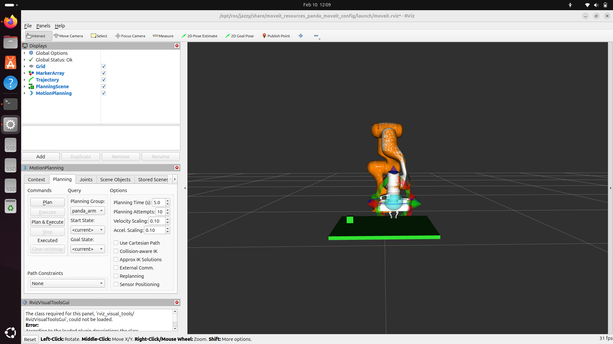
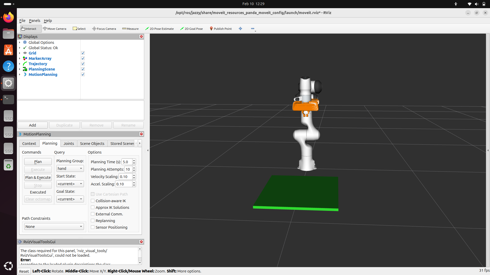
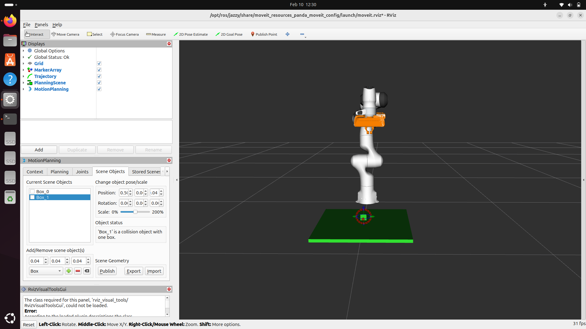

# robotics-intern-assignment
ROS2 FR3 robot with eye-in-hand camera (internship assignment)
## 📸 Screenshots
The following screenshots show the FR3 robot model, eye-in-hand camera attachment, and RViz visualization.

## 🎥 Demo Video
Demo video link:  
https://drive.google.com/drive/folders/1bVhx7XlzRDF0bxvEecdpySPIc3PyEQ4U?usp=sharing

## ▶ How to Run

1. Clone the repository
2. Build the workspace using colcon
3. Launch the FR3 robot description with RViz
4. Visualize the eye-in-hand camera setup
